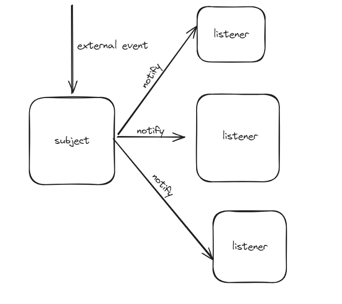

#### Description
This is a pattern that describes a way to implement the behavior between two or more objects. This is a behavioral design pattern.

Let's take it this way. Suppose you have two objects, one called the "Subject", and the other called the "Listener". Now, when something happens to the subject, we want to do the below.

1. Notify the listener that something has happened to the subject, without coupling them both.
2. In the case of multiple listeners, notify all listeners of the change to the subject. And also be able to dynamically register and unregister them from listening to changes on the subject.



Now assuming you have an system that handles payments. You have a payment manager which receives payments. Once a payment is received, it notifies the payment event logger for it to record that a payment has been made. Now the payment manager also goes ahead to notify the notification manager about the payment. The notification manager can go ahead to notify the user of the payment through a push notification. How do we implement this with the observer pattern.


```java
public static void main(String[] args){

}
```

```java
public class PaymentManager{
    public void pay(){

    }
}
```

```java
public class PaymentEventLogger{
    public void logEvent(){
        System.out.println("Payment Received");
    }
}
```

```java
public class NotificationManager{
    public void sendNotification(){
        System.out.println("Notification sent");
    }
}
```

The problem here is that when the `pay()` method in the `PaymentManager` is called, we want both the `NotificationManager` and the `PaymentEventLogger` to be called, notified by the payment so they do something. The simplest way to do that is to just make the objects coupled to each other. 

So when we call the pay method in the main class...
```java
public static void main(){
    PaymentManager paymentManager = new PaymentManager();
    paymentManager.pay();
}
```


We can declare the other classes as constants in the Payment manager.
```java
public class PaymentManager{
    private final NotificationManager nm = new NotificationManager();
    private final PaymentEventLogger pel = new PaymentEventLogger();

    public void pay(){
        nm.sendNotification();
        pel.logEvent();
    }
}
```
There are a few problems in the above approach:

1. Then first problem is that the `PaymentManager` is now heavily coupled with both the `NotificationManager` and the `PaymentEventLogger`. The `PaymentManager` knows of the existence of the two classes, so there is a strong link between them. 
2. The second problem is that, for every payment, you will always have to send a notification, and you will always have to store a log event in the database.

But there are some cases where we only want to log the event, or only send a notification, or sometimes do both. This can become tedious because there are multiple thing that happen when this `pay` method is called. Now, how do we implement this in such a way that we can tell which events trigger when the `pay` method is called. We have to decouple the classes, and this is where the `Observer Pattern` comes in.

We want to implement it in such a way we make our listener classes(`NotificationManager` and `PaymentEventLogger`) have the chance to register and unregister from listening to the `pay()` method call. And the `pay()` method notifies the registered listeners, without needing to know which listeners it notifies. So the objects will be completely decoupled.


To do that, the `PaymentManager` doesn't need to know that it notifies both listeners. But we can wrap an umbrella around these listeners, so that the `PaymentManager` knows that it notifies someone, but it doesn't care about who it notifies. So we need to find a name for that someone. Let's call this someone a `PaymentListener`. 

This `PaymentListener` listens/observes the payment execution. So the Payment listener will execute when the `pay()` method is called. So our `NotificationManager` and our `PaymentEventLogger` will both become the payment listener. 

The `PaymentListener` is not a concrete object. It is simply just a way to abstractly represent some objects observing the `pay()` method. There are two ways of implementing an abstract object in java. One is the `Abstract Class`, the other is the `Interface`. But the abstract class is only used when we have a part of the object described. In this case we are only concerned about the objects that will become the payment listener. And the payment listeners elicit a behavior when the `pay()` method is called. Therefore, the `PaymentListener` must be an interface.

We only need a contract that will be implemented by anyone observing the payments in the payment manager.

```java
public interface PaymentListener{
    void paymentMade();
}
```

Now that we have our `PaymentListener` we have to make sure that our `PaymentManager` has its `PaymentListeners`

```java
public class PaymentManager{
    private final List<PaymentListener> paymentListeners = new ArrayList<>();


    public void pay(){
        // do something
        paymentListener.forEach(PaymentListener::paymentMade); // p -> p.paymentMade();
    }

    /* what we wanna make sure of is that we have a way in which, from outside the payment listener, we can register a listener inside the list above. we can do that with the below method */

    public void registerListener(PaymentListener p){
        paymentListeners.add(p);
    }

    /* we also need to have a method that will unregister payment listeners */
    
    public void unregisterListener(PaymentListener p){
        paymentListeners.remove(p);
    }
}
```

In the above implementation, the `PaymentManager` doesn't know how many instances of `PaymentListeners` there are, all it does is that notifies whoever is using the `paymentListeners` contract.

Now, we can go to our `NotificationManager` and `PaymentEventLogger` and make it use the `PaymentListener` contract.

```java
public class NotificationManager implements PaymentListener{
    @Override
    public void paymentMade(){
        sendNotification();
    }

    private void sendNotification(){
        System.out.println("Notification sent");
    }
}
```

```java
public class PaymentEventLogger implements PaymentListener{
    @Override
    public void paymentMade(){
        logEvent();
    }

    private void logEvent(){
        System.out.println("Payment Received");
    }
}
```

And now, instead of actually registering these two listeners in the `PaymentManager`, you will register them outside of it.(we don't want them to know about each other remember?). So, we can register them in our main class. see below

```java
public static void main(String[] args){
    PaymentManager paymentManager = new PaymentManager();

    PaymentListener p1 = new NotificationManager();
    paymentManager.registerPaymentListener(p1);

    PaymentListener p2 = new PaymentEventLogger();
    paymentManager.registerPaymentListener(p2);

    /* everytime the pay method is called, all listeners will be called */
    paymentManager.pay();
    paymentManager.pay();
    paymentManager.pay();

    paymentManager.unregisterPaymentListener(p2); // only p1 will will trigger
    paymentManager.pay();
}
```