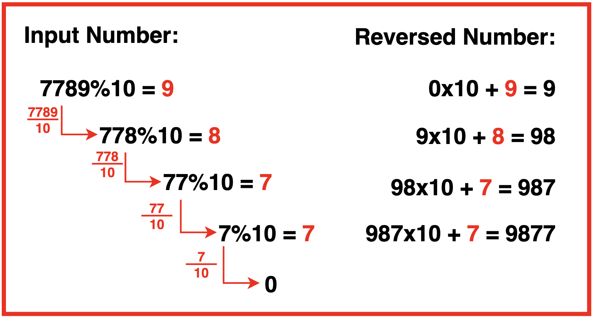

To reverse the digits of a number, we can use the algorithm created in Extract Digits just that now instead of extracting digits we are simply appending them to the reversed number.




Algorithm
* Step 1:Initialise an integer revNum to 0. This variable will store the reversed number.

* Step 2: Using a while loop we iterate while the input integer n is greater than 0 and at each iteration:

* Step 3: Calculate the last digit of the number using the modulus operator (N%10) and store it in a variable last digit.
* Step 4: Get rid of the last digit in the input integer by dividing itself by 10.
* Step 5: Update the reversed number by multiplying it with 10 and adding the last digit. This effectively appends the last digit to the end of the reversed number.

* Step 6: After exiting the while loop, return the reversed number.

Below is a sample implementation in Java
```java
public class Main {
    public static void reverse(int n) {
        // Initialize a variable 'revNum' to
        // store the reverse of the input integer.
        int revNum = 0;
        // Start a while loop to reverse the
        // digits of the input integer.
        while(n > 0){
            // Extract the last digit of
            // 'n' and store it in 'ld'.
            int ld = n % 10;

            // Remove the last digit from 'n'.
            n = n / 10;
            
            // Multiply the current reverse number
            // by 10 and add the last digit.
            revNum = (revNum * 10) + ld;
        }
        // Print the reversed number.
        System.out.println(revNum);
    }
}
```